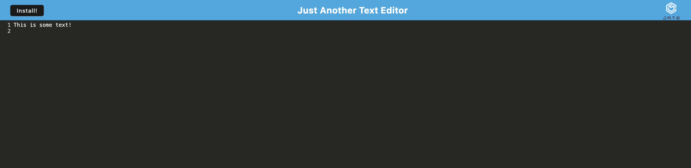
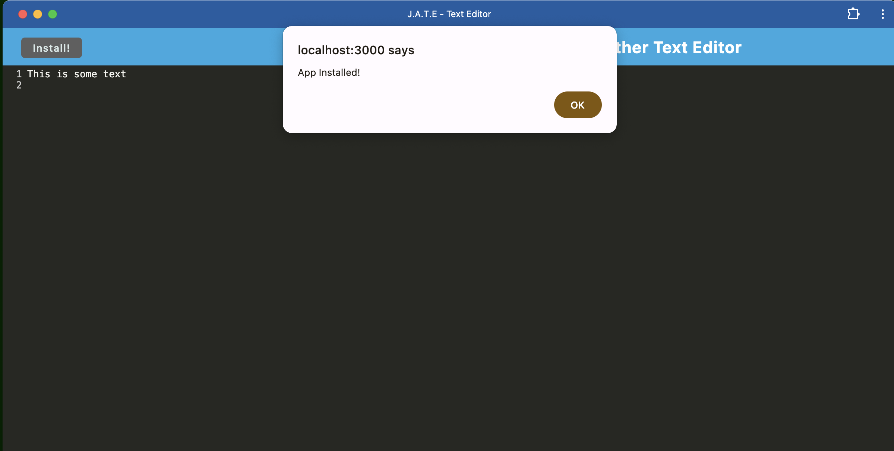

# Text-Editor-Application

## Table of Contents

* [Introduction](#introduction)
* [Features](#features)
* [Installation](#installation)
* [Technologies Used](#technologies-used)
* [Usage](#usage)
* [Screenshots](#screenshots)
* [Future Developments](#future-developments)
* [Contact](#contact)
* [Contributions](#contributions)
* [License](#license)
* [Demo](#demo)

# Introduction

This is a Progressive Web Application text editor that utilizes Webpack, Workbox, and Web App Manifest that allows users to create and edit notes as well as code snippets seamlessly.

# Features

* Contains a client server folder structure.
* Javascript files are bundled using webpack.
* Webpack plugins generate an HTML file, service worrker, and a manifest file.
* IndexedDB creates a database storage which ensures text editor saved content even after DOM Window has been closed.
* Contains a download button to install application with an icon on a desktop.
* Registers a service worker with Workbox.
* Service Worked pre-caches static assests along with subsequent pages.

# Installation

This project can be accessed via the live demo link or locally by following these steps:

1. Clone the repository to your local machine.
2. Install the necessary dependencies by running npm install.
3. Start the application by running npm run develop in your terminal.

## Technologies Used

* Webpack
* Webpack Plugins
* IndexedDB
* Workbox Service Worker
* Inject Manifest
* Workbox Manifest

## Usage

* Enter a line of text or code.
* Close browser and/or navigate to another tab.
* Return to the application to find input has been saved.
* Navigate to developer tools and the application tab to see cached assets.
* Click the install button to install the application.
* Navigate to the desktop to find text editor icon.
* Open the newly installed application and continue to enter and save text.

## Screenshots

### Landing Page

### Installed Application

## Future Developments

* Ensure images are able to be cached and stored into the text editor.

## Contact

If there are any questions or feedback, feel free to reach out via: 

* Github Issues: [Github](http://Github.com/Taylor-Brandon)

* Email: [Email](mailto://taylorbrandon.dev@gmail.com)

## Contributions

Special thanks to Columbia Bootcamps for providing the educational resources necessary to complete this project.

## License

## Demo

Find the Live application here: [Demo](https://text-editor-app-74b27f1d557f.herokuapp.com/)